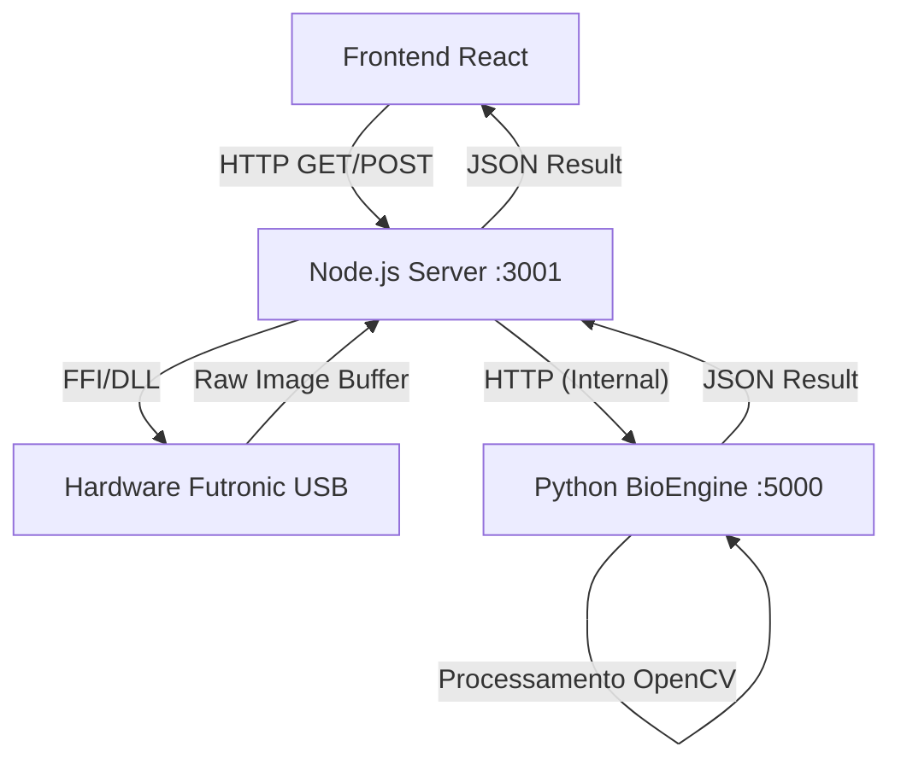

# Documentação Técnica: Gestão EPI - Driver de Biometria

## 1. Visão Geral
O **Gestão EPI Biometria Driver** é um microserviço local ("Service-Side Client") projetado para atuar como ponte entre a aplicação Web (Frontend React) e o hardware de leitura biométrica (Scanners Futronic FS88H/FS80).

Devido às limitações de segurança dos navegadores web (que não acessam portas USB diretamente de forma nativa e ampla para drivers proprietários), este serviço roda na máquina do cliente, expondo uma API HTTP local que o navegador consome para realizar capturas e validações.

### Principais Características
- **Arquitetura Híbrida:** Orchestrator em **Node.js** (controle de hardware) + Core de Processamento em **Python** (Visão Computacional).
- **Algoritmo de Match:** Utiliza **ORB (Oriented FAST and Rotated BRIEF)** via OpenCV, uma alternativa eficiente e livre de patentes ao SIFT/SURF.
- **Integração de Hardware:** Acesso direto às DLLs nativas do Windows (`ftrScanAPI.dll`) via FFI (Foreign Function Interface) usando `koffi`.

---

## 2. Arquitetura do Sistema

O sistema opera em um modelo de **Pipeline de 3 Estágios**:

1.  **Frontend (Web):** Solicita a operação (ex: `/capturar-cadastro`).
2.  **Node.js (Driver Manager):** 
    - Gerencia a conexão USB com o dispositivo.
    - Controla LEDs e feedback visual.
    - Obtém a imagem "crua" (Raw BMP).
    - Repassa a imagem para o motor Python.
3.  **Python (BioEngine):**
    - Processa a imagem.
    - Extrai minúcias (Keypoints e Descritores).
    - Realiza cálculos matemáticos de comparação (Matching).

### Diagrama de Fluxo de Dados


---

## 3. Especificações da API (Node.js)

O serviço expõe endpoints REST na porta padrão `3001` (configurável).

### 3.1 Healthcheck
Verifica se o serviço e o motor Python estão ativos.
- **Endpoint:** `GET /status`
- **Retorno:**
  ```json
  {
    "status": "online",
    "python_status": "running",
    "node_port": 3001
  }
  ```

### 3.2 Captura para Cadastro
Utilizado quando um novo funcionário está sendo registrado. O sistema captura a digital e retorna um template matemático para ser salvo no banco de dados.
- **Endpoint:** `GET /capturar-cadastro`
- **Processo:**
  1. Ativa o scanner e aguarda o dedo.
  2. Captura a imagem.
  3. Envia ao Python para extração de features.
- **Retorno Sucesso:**
  ```json
  {
    "success": true,
    "image_preview": "data:image/bmp;base64,...", // Para exibir na UI
    "template_final": "500:32|blob_base64..."     // Para salvar no SQL (NÃO exibir)
  }
  ```

### 3.3 Validação de Entrega (Match)
Utilizado para confirmar a identidade ao entregar um EPI.
- **Endpoint:** `POST /validar-entrega`
- **Body:**
  ```json
  {
    "templateSalvoNoBanco": "500:32|blob_base64..."
  }
  ```
- **Processo:**
  1. Node.js captura uma **nova** amostra do dedo do funcionário presente.
  2. Envia para o Python: `template_armazenado` + `imagem_atual`.
  3. Python compara se a `imagem_atual` corresponde ao `template_armazenado`.
- **Retorno:**
  ```json
  {
    "success": true,
    "match": true, // ou false
    "score": 45    // Pontuação de similaridade
  }
  ```

---

## 4. Detalhamento Técnico Interno

### 4.1 Camada de Hardware (Node.js + Koffi)
Localizada em `src/services/FutronicService.js`.

Utilizamos a biblioteca `koffi` para carregar a `ftrScanAPI.dll`. O fluxo de captura não é bloqueante (utiliza `setInterval` para polling), permitindo que o servidor continue respondendo enquanto aguarda o dedo.

**Funções Nativas Mapeadas:**
- `ftrScanOpenDevice()`: Abre canal de comunicação USB.
- `ftrScanIsFingerPresent()`: Verifica se há dedo no sensor.
- `ftrScanGetImage()`: Transfere o buffer de bytes da imagem para a memória RAM.
- `ftrScanSetDiodesStatus()`: Controla os LEDs (Verde/Vermelho) para feedback de UX.

### 4.2 Camada de Inteligência (Python + OpenCV)
Localizada em `python-core/engine.py`.

Este microsserviço roda isolado usando **FastAPI**. Ele é iniciado automaticamente pelo Node.js (`spawn process`).

#### Algoritmo ORB (Oriented FAST and Rotated BRIEF)
Optamos pelo ORB em vez de SIFT ou SURF por ser open-source (livre de royalties) e extremamente rápido para aplicações em tempo real.

**Processo de Extração (`/extract`):**
1. Converte imagem Base64 para Matriz NumPy (Escala de Cinza).
2. `orb.detectAndCompute()`: Identifica até 500 pontos de interesse únicos na digital.
3. **Serialização:** Os descritores (matriz binária) são serializados em uma string customizada:
   > Formato: `LINHAS:COLUNAS|BASE64_DO_NUMPY_ARRAY`
   > Exemplo: `500:32|a8Bc9...`

**Processo de Comparação (`/match`):**
1. Reconstrói o template do banco a partir da string customizada.
2. Extrai novos descritores da imagem recém capturada.
3. Utiliza **Brute Force Matcher (BFMatcher)** com norma **HAMMING**.
   - A distância de Hamming é ideal para comparar strings binárias (descritores ORB).
4. **Cálculo de Score:** O score é baseado no número de "bons matches" geométricos.
5. **Threshold (Limiar):** Definido como **20**. Scores acima de 20 são considerados positivos (Match).

---

## 5. Instalação e Requisitos

### Pré-requisitos
1. **Node.js** v18+ instalado.
2. **Python** 3.10+ instalado (necessário adicionar ao PATH).
3. **Drivers Futronic:** O driver USB do fabricante deve estar instalado no Windows.

### Estrutura de Pastas Esperada
```
/
├── bin/
│   └── ftrScanAPI.dll  (Obrigatório estar presente)
├── src/
│   └── server.js
├── python-core/
│   ├── engine.py
│   └── requirements.txt
```

### Configuração do Ambiente
1. Instale as dependências do Node:
   ```bash
   npm install
   ```
2. Instale as dependências do Python (ou use o ambiente virtual pré-configurado):
   ```bash
   cd python-core
   pip install -r requirements.txt
   ```

### Executando
Para desenvolvimento (inicia Node + Python automaticamente):
```bash
npm run dev
```

---

## 6. Solução de Problemas Comuns

| Problema | Causa Provável | Solução |
| hum | hum | hum |
| **Erro "DLL não encontrada"** | O arquivo `ftrScanAPI.dll` não está na pasta `bin/` ou caminho incorreto no `config`. | Verifique se a DLL está na pasta `bin` na raiz do projeto. |
| **Erro "OpenDevice Failed"** | Scanner desconectado ou driver USB do Windows não instalado. | Verifique o Gerenciador de Dispositivos do Windows. |
| **Python Crash / Spawn Error** | Python não instalado ou não adicionado ao PATH do sistema. | Tente rodar `python --version` no terminal. |
| **Match Falhando (False Negative)** | Dedo sujo ou posicionado de forma muito diferente do cadastro. | Limpar o sensor e recadastrar o dedo centralizado. |

---
**Equipe de Desenvolvimento Gestão EPI**
*Documento gerado em Jan/2026*
