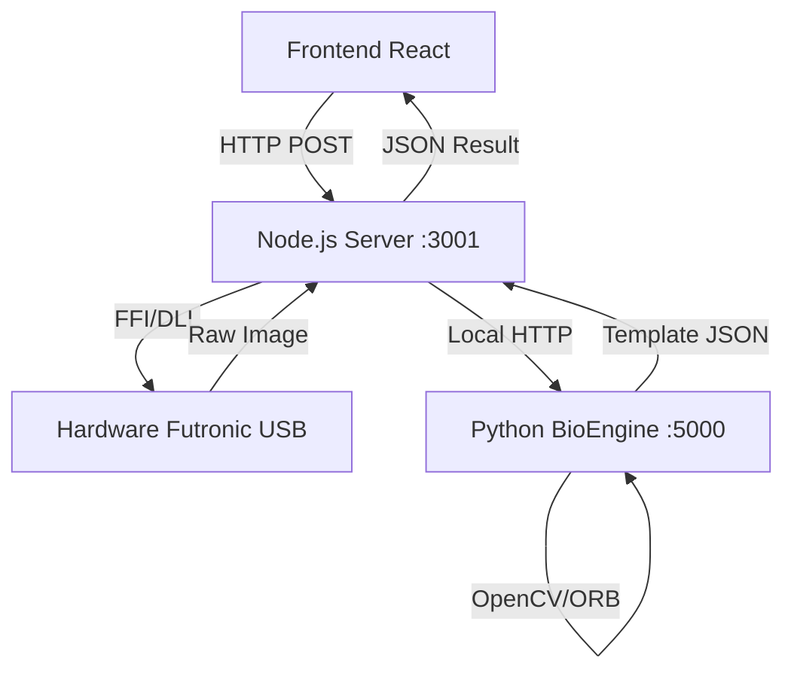

# 🧬 Gestão EPI - Driver Biométrico

[](https://github.com/ArtFaz/gestao-epi-biometria-driver/blob/main/README.md)
[](https://github.com/ArtFaz/gestao-epi-biometria-driver/blob/main/README_EN.md)

[](https://github.com/ArtFaz/gestao-epi-biometria-driver)
[](https://nodejs.org/)
[](LICENSE)

[](https://github.com/ArtFaz/gestao-epi-biometria-driver/releases/latest)

Interface de comunicação local para leitores biométricos USB Futronic (FS80/FS88H). Este driver atua como um middleware entre o navegador e o hardware, permitindo a captura e validação de digitais em aplicações web.

## 🏗 Arquitetura

O sistema utiliza um modelo híbrido para separar o controle de hardware do processamento de imagem:



- **Node.js (Orquestrador):** Gerencia a comunicação com a DLL via FFI e controla o hardware.
- **Python (BioEngine):** Microserviço focado em Visão Computacional (OpenCV) para extração de minúcias.

---

## 🛠 Configuração

### 1. Instalação
O comando abaixo instala as dependências do Node e do Python de uma só vez:

```bash
npm run setup
```

### 2. Variáveis de Ambiente
Configure o arquivo `.env` (use o `.env.example` como base):

```bash
cp .env.example .env
```

| Variável | Descrição |
| :--- | :--- |
| `USE_MOCK_DRIVER` | `true` para simular capturas sem hardware conectado. |
| `PORT` | Porta do servidor Node (padrão 3001). |
| `PYTHON_PORT` | Porta interna do motor Python (padrão 5000). |

### 3. Execução
Inicia ambos os serviços (Node + Python):

```bash
npm run dev
```

---

## 🧪 Modos de Uso

### Simulação (Mock)
Caso não possua o leitor biométrico, defina `USE_MOCK_DRIVER=true`. O sistema retornará dados sintéticos e um placeholder de imagem, permitindo o desenvolvimento do frontend sem o hardware físico.

### Hardware Real
Exige a presença do arquivo `ftrScanAPI.dll` na pasta `bin/` e drivers do fabricante instalados no Windows.

---

## 📡 Endpoints da API

### `GET /status`
Retorna a integridade do driver e do motor biométrico.

### `GET /capturar-cadastro`
Inicia a leitura no scanner e retorna o template matemático da digital.
- **Resposta:** `{ "success": true, "image_preview": "...", "template_final": "..." }`

### `POST /validar-entrega`
Compara o dedo no leitor com um template vindo do banco de dados.
- **Body:** `{ "templateSalvoNoBanco": "..." }`
- **Resposta:** `{ "success": true, "match": true, "score": 45 }`

---

## ⚖️ Licença e Aviso Legal

Este projeto utiliza a biblioteca `ftrScanAPI.dll` de propriedade da **Futronic Technology Company Ltd**. A DLL está incluída na pasta `bin/` apenas para conveniência de execução em ambientes de desenvolvimento Windows.
*   Certifique-se de possuir as licenças adequadas para uso comercial do hardware Futronic.
*   O restante do código (Node.js e Python) é distribuído sob licença MIT.
