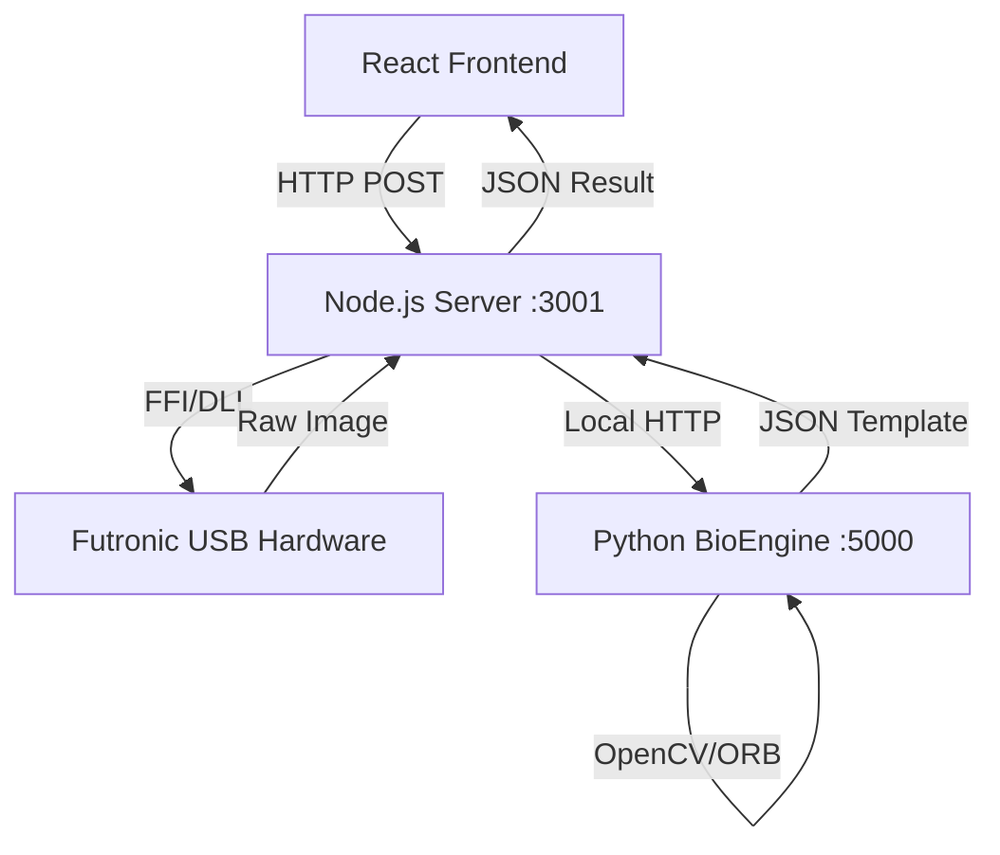

# 🧬 PPE Management - Biometric Driver

[](https://github.com/ArtFaz/gestao-epi-biometria-driver/blob/main/README.md)
[](https://github.com/ArtFaz/gestao-epi-biometria-driver/blob/main/README_EN.md)

[](https://github.com/ArtFaz/gestao-epi-biometria-driver)
[](https://nodejs.org/)
[](LICENSE)

[](https://github.com/ArtFaz/gestao-epi-biometria-driver/releases/latest)

Local communication interface for Futronic USB biometric scanners (FS80/FS88H). This driver acts as middleware between the web browser and the hardware, enabling fingerprint capture and validation in web applications.

## 🏗 Architecture

The system uses a hybrid model to decouple hardware control from image processing:



- **Node.js (Orchestrator):** Manages DLL communication via FFI and hardware control.
- **Python (BioEngine):** Microservice focused on Computer Vision (OpenCV) for minutiae extraction.

---

## 🛠 Configuration

### 1. Installation
The command below installs both Node and Python dependencies at once:

```bash
npm run setup
```

### 2. Environment Variables
Set up your `.env` file (use `.env.example` as a template):

```bash
cp .env.example .env
```

| Variable | Description |
| :--- | :--- |
| `USE_MOCK_DRIVER` | Set to `true` to simulate captures without hardware connected. |
| `PORT` | Node server port (default 3001). |
| `PYTHON_PORT` | Python engine internal port (default 5000). |

### 3. Execution
Starts both services (Node + Python):

```bash
npm run dev
```

---

## 🧪 Usage Modes

### Mock Mode (Simulation)
If you don't have the biometric reader, set `USE_MOCK_DRIVER=true`. The system will return synthetic data and an image placeholder, allowing frontend development without the physical hardware.

### Real Hardware Mode
Requires the `ftrScanAPI.dll` file in the `bin/` folder and manufacturer drivers installed on Windows.

---

## 📡 API Endpoints

### `GET /status`
Returns the health status of the driver and the biometric engine.

### `GET /capturar-cadastro`
Triggers the scanner and returns the mathematical fingerprint template for registration.
- **Response:** `{ "success": true, "image_preview": "...", "template_final": "..." }`

### `POST /validar-entrega`
Compares the current finger on the scanner with a template from the database.
- **Body:** `{ "templateSalvoNoBanco": "..." }`
- **Response:** `{ "success": true, "match": true, "score": 45 }`

---

## ⚖️ License and Legal Notice

This project uses the `ftrScanAPI.dll` library owned by **Futronic Technology Company Ltd**. The DLL is included in the `bin/` folder for convenience in Windows development environments only.
*   Ensure you have the appropriate licenses for commercial use of Futronic hardware.
*   The rest of the code (Node.js and Python) is distributed under the MIT license.
