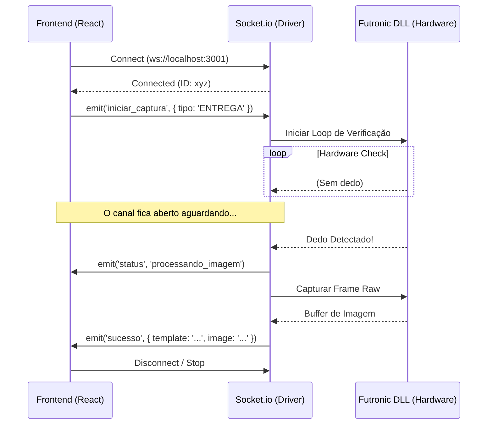

# 📡 Plano de Migração: Driver Biométrico via WebSockets

**Data:** 13/01/2026  
**Status:** Rascunho / Planejamento  
**Objetivo:** Substituir o polling HTTP atual por uma comunicação Event-Driven em tempo real.

---

## 1. Contexto e Motivação

Atualmente, a comunicação entre o Frontend (React) e o Driver Local (Node.js) é baseada em **HTTP Request/Response**. Para detectar a presença de um dedo no leitor, o frontend realiza chamadas repetitivas (Polling) a cada *x* milissegundos.

### Problemas Atuais (Polling HTTP)
1.  **Latência de Feedback:** O usuário coloca o dedo, mas o sistema só reage no próximo ciclo de requisição.
2.  **Overhead de Rede:** Múltiplas conexões TCP sendo abertas e fechadas desnecessariamente.
3.  **UX Pobre:** Dificuldade em fornecer feedback granular (ex: "Dedo detectado, processando...", "Mova o dedo").
4.  **Complexidade de Cancelamento:** Se o usuário fecha o modal, o backend pode continuar tentando capturar até que a requisição expire.

### Solução Proposta (WebSockets)
Utilizar **Socket.io** para manter um túnel bidirecional persistente. O servidor "empurra" dados para o cliente assim que eventos de hardware ocorrem.

---

## 2. Arquitetura da Solução

### Stack Tecnológica
-   **Backend (Driver):** `socket.io` (v4+)
-   **Frontend (App):** `socket.io-client` (v4+)

### Fluxo de Dados



---

## 3. Protocolo de Eventos

Definição dos eventos padrões para comunicação cliente-servidor.

### Cliente -> Servidor (Comandos)

| Evento | Payload | Descrição |
| :--- | :--- | :--- |
| `start_capture` | `{ timeout: 15000, mode: 'identify' }` | Solicita o início da leitura. |
| `cancel_capture` | `{}` | Força a interrupção da leitura e desliga os LEDs. |
| `client_ready` | `{}` | Confirma que a UI está renderizada e pronta para ouvir. |

### Servidor -> Cliente (Respostas)

| Evento | Payload | Descrição |
| :--- | :--- | :--- |
| `driver_status` | `{ state: 'idle' \| 'scanning' }` | Estado atual do driver. |
| `feedback` | `{ msg: 'Coloque o dedo', type: 'info' }` | Mensagens para exibir na UI em tempo real. |
| `finger_detected` | `{}` | Avisa que o hardware detectou presença (acender UI). |
| `capture_success` | `{ image: 'base64...', template: '...' }` | Captura finalizada com sucesso. |
| `capture_error` | `{ code: 'ERR_TIMEOUT', msg: '...' }` | Erro na captura ou timeout. |

---

## 4. Plano de Implementação

### Fase 1: Backend (Driver)
1.  Instalar dependência: `npm install socket.io`.
2.  Refatorar `server.js` para envolver o `app` (Express) com `http.createServer`.
3.  Inicializar instância do `Server` (Socket.io) com CORS habilitado para `localhost:5173`.

### Fase 2: Service Layer (Non-Blocking)
*Desafio Crítico:* A DLL da Futronic não pode bloquear o Event Loop do Node.js, senão o Socket.io perderá o heartbeat e desconectará.

1.  Alterar `FutronicService.js`.
2.  Substituir loops `while(true)` por `setInterval` ou chamadas recursivas via `setImmediate` para permitir que o Node processe outros eventos de IO entre as checagens do hardware.
3.  Implementar mecanismo de "abort signal" para parar o loop quando o evento `disconnect` ocorrer.

### Fase 3: Frontend (React Hook)
Criar um hook reutilizável `useBiometriaSocket` em `src/hooks/`.

```javascript
// Exemplo de uso planejado
const { status, iniciarCaptura, cancelar } = useBiometriaSocket();

return (
  <button onClick={iniciarCaptura}>Ler Digital</button>
  {status === 'scanning' && <p>Coloque o dedo...</p>}
);
```

### Fase 4: Teste de Resiliência
1.  Testar desconexão abrupta (fechar aba) -> Driver deve desligar LEDs.
2.  Testar reconexão automática (driver reiniciado) -> Frontend deve reconectar.

---

## 5. Benefícios Esperados

| Métrica | HTTP (Atual) | WebSocket (Futuro) |
| :--- | :--- | :--- |
| **Latência** | 500ms - 1000ms (Intervalo Polling) | < 50ms (Tempo Real) |
| **Carga CPU** | Média (Processamento de reqs HTTP) | Baixa (Conexão ociosa) |
| **Feedback UX** | Estático | Dinâmico/Fluido |

## 6. Próximos Passos
Para iniciar esta migração, aprovar este documento e criar uma branch `feature/websocket-driver`.
